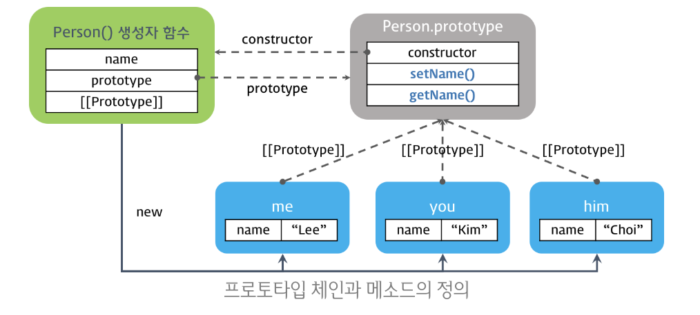
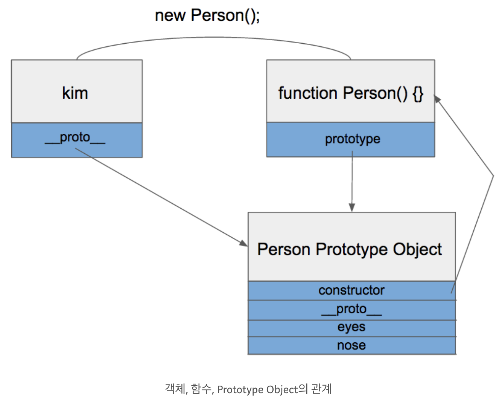
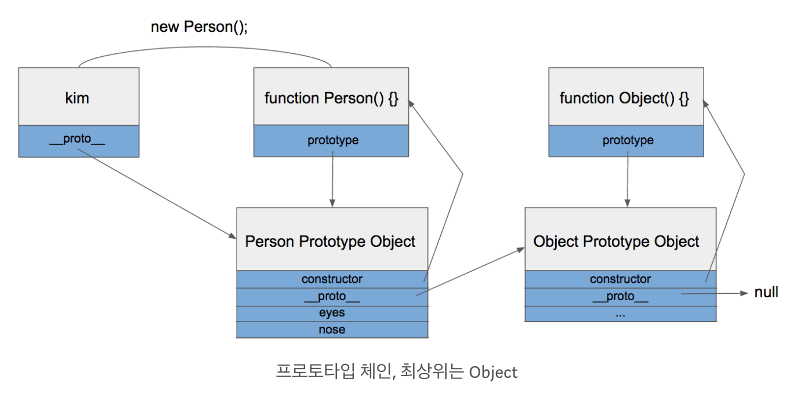

# 자바스크립트의 객체지향 프로그램

- 객체지향 프로그래밍 : 실세계에 존재하고 인지하고 있는 객체를 소프트웨어의 세계에서 표현하기 위해 핵심적인 개념, 기능을 추출하는 추상화를 통해 모델링 하려는 프로그래밍 패러다임을 의미한다.

<br/><br/>

## 객체표현
---
### 1. object literal
- class 없이 object 로 표현이 가능하다. (비효율적)
```js
let answerArr = ["이주연", "PM12:12"]

const orderObj = {
  name : answerArr[0],
  lastTime : answerArr[1],
  showmsg : function () {
    console.log(this.name + "님, 지금은 " + this.lastTime + "입니다");
  }
}

orderObj.showmsg();  //이주연님, 지금은 PM12:12 입니다
```

<br/>

--- 

<br/>


### 2. constructor pattern (생성자 패턴)
- 자바스크립트는 클래스 기반의 언어는 아니지만, 함수와 new 를 통해 클래스 비슷하게 흉내낼 수 있다.
- constructor(생성자, new) 은 새로운 instance 를 만들어서 반환한다.
- 생성자패턴에서 this를 사용한 함수에는 return this 가 생략되어 있다.
```js
const answerArr=["이주연","pm12:12"];

const orderObj = function(name,lastTime) {
  this.name = name;
  this.lastTime = lastTime;
  this.showHealth = function() {
    console.log(this.name + "님, 지금은 " + this.lastTime + "입니다");
  }
}

const ju = new orderObj(answerArr[0], answerArr[1]);
ju.showHealth(); //이주연님, 지금은 PM12:12 입니다
```
<br/><br/>
> 하지만 constructor pattern은 각각의 생성자 객체에 불필요한 메모리공간이 생기게 되는 한계가 있다.


```js
ju
//orderObj {name: "이주연", lastTime: "pm12:12", showHealth: ƒ}
```
<br/><br/>

--- 

### 3. Class (ES2015)
- class 는 prototype 을 자동으로 생성해서 만들어주는 method 이다. 
- constructor pattern 과 패턴은 비슷해보이지만 내부 메모리 저장 구조는 다르다. 
    
   - constructor 가 생성되어도, 메모리는 각 메모리 객체가 생성되어 저장되는 것이 아닌, prototype 의 공간에 저장이 된다.
   - 따라서 불필요한 메모리가 생성되지 않는다
- class 를 새롭게 생성하면 constructor은 자동으로 생성된다.

```js
let answerArr = ["이주연", "PM12:12"]

const orderObj = class{
	constructor(name,lastTime){
		this.name = name;
		this.lastTime = lastTime;
	};
	showmsg(){
    console.log(this.name + "님, 지금은 " + this.lastTime + "입니다");
	}
}

const ju = new orderObj(answerArr[0], answerArr[1]);

ju.showmsg(); //이주연님, 지금은 PM12:12 입니다
```

<br/><br/>

------ 
### 4. Prototype pattern
- 객체의 원형인 프로토타입을 이용하여 새로운 객체를 만들어내는 프로그래밍 기법

```js
let answerArr = ["이주연", "PM12:12"]

const orderObj = function(name, lastTime) {
  this.name = name;
  this.lastTime = lastTime;
}

orderObj.prototype.showmsg = function() {
  console.log(this.name + "님, 지금은 " + this.lastTime + "입니다");
}

const ju = new orderObj(answerArr[0], answerArr[1]);
ju.showmsg(); //이주연님, 지금은 PM12:12 입니다
```
<br/><br/>

> ### 4-1. 메모리 관련 자바스크립트의 프로토타입 


```js
// 생성자 함수(Constructor)
function Person(name) {
  // 프로퍼티
  this.name = name;

  // 메소드
  this.setName = function (name) {
    this.name = name;
  };

  // 메소드
  this.getName = function () {
    return this.name;
  };
}

// 인스턴스의 생성
var me = new Person('Lee');
console.log(me.getName()); // Lee

// 메소드 호출
me.setName('Kim');
console.log(me.getName()); // Kim
```

<br/>

[메모리 할당 문제 발생]
```js
var me  = new Person('Lee');
var you = new Person('Kim');
var him = new Person('Choi');

console.log(me);  // Person { name: 'Lee', setName: [Function], getName: [Function] }
console.log(you); // Person { name: 'Kim', setName: [Function], getName: [Function] }
console.log(him); // Person { name: 'Choi', setName: [Function], getName: [Function] }
```
<br/><br/>
[메모리문제가 해결된 prototype]
```js
function Person(name) {
  this.name = name;
}

// 프로토타입 객체에 메소드 정의
Person.prototype.setName = function (name) {
  this.name = name;
};

// 프로토타입 객체에 메소드 정의
Person.prototype.getName = function () {
  return this.name;
};

var me  = new Person('Lee');
var you = new Person('Kim');
var him = new Person('choi');

console.log(Person.prototype);
// Person { setName: [Function], getName: [Function] }

console.log(me);  // Person { name: 'Lee' }
console.log(you); // Person { name: 'Kim' }
console.log(him); // Person { name: 'choi' }
```

<br/>

[객체, 함수, prototype Object의 관계]

- eyes와 nose를 어딘가에 있는 빈 공간에 넣어놓고 kim과 park이 공유해서 사용함.

<br/><br/>

> ### 4-2. 메모리 관련 자바스크립트의 프로토타입 
<br/>


[프로토타입 체인, 최상위는 Object]

- kim 객체는 eyes를 직접 가지고 있지 않기 때문에 eyes의 속성을 찾을 때까지 상위 프로토타입을 탐색한다. 
- 최상위인 Object의 prototype Object 까지 도달했는데도 못찾았을 경우 undefined 를 리턴함
- 프로토타입 체인 : _proto_ 속성을 통해 상위 프로토타입과 연결되어 있는 형태

<br/><br/>
## 2. 프로토타입 객체생성방법

```js
// 객체 리터럴
var obj1 = {};
obj1.name = 'Lee';

// Object() 생성자 함수
var obj2 = new Object();
obj2.name = 'Lee';

// 생성자 함수
function F() {}
var obj3 = new F();
obj3.name = 'Lee';
```

<br/><br/>
## 3. 상속 (Inheritance)
### 3-1 의사 클래스 패턴 상속
super()


참고 : http://insanehong.kr/post/javascript-prototype/
https://poiemaweb.com/js-object-oriented-programming