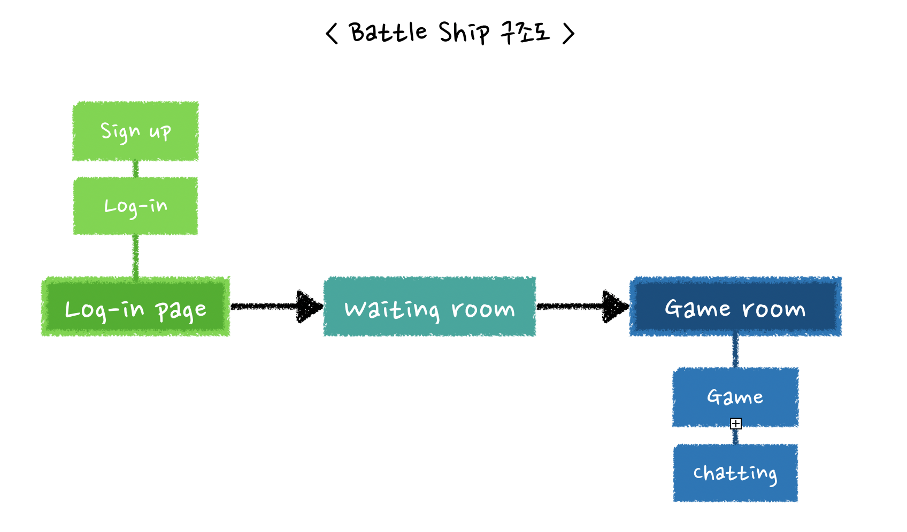
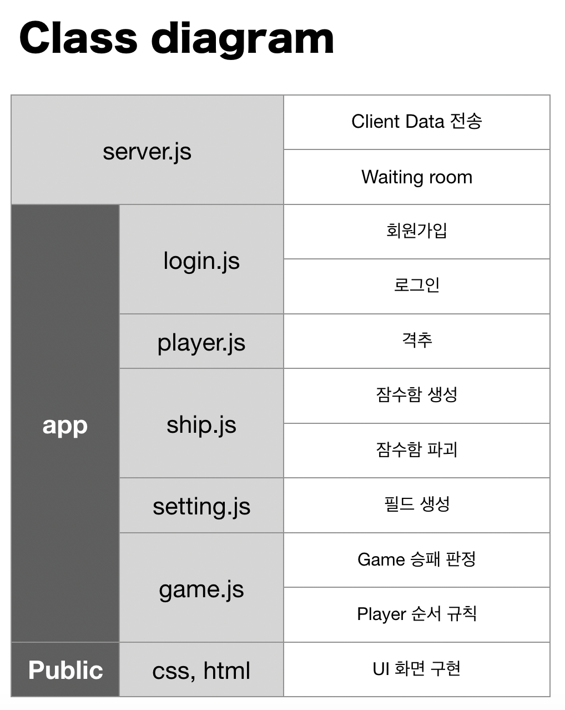

## 프로젝트 기획서

 

> 프로젝트 명
- node.js 를 통한 Battle ship 게임 제작

 

> 프로젝트 담당

- Ruby

 

> 프로젝트 시행 목적 
- 게임제작을 통해 oop 와 node.js의 통신방식을 공부
    1.  게임에 필요한 부품을 객체지향으로 구현하여 OOP를 공부한다.
    2. node.js의 실시간 통신 구현 방법을 공부한다.

 

> 프로젝트 시기
- 19.05.27 ~ 19.05.31 : 기획 및 설계, 간단한 채팅 기능 구현
- 19.05.31 ~ 19.06.07 : oop로 객체화, 게임 구현
- 19.06.10 : 프로젝트 배포

 

> 프로젝트 내용
- 게임 설계
    1. 회원가입, 로그인 후 게임에 접속한다. 
    2. 로그인 하면 바로 게임에 접속할 수 있다.
    3. 한 명만 접속하거나 세 명 이상 접속할 때, 해당 인원은 waiting room에서 기다린다.
- 게임 내용
    1. 10*10 바다에 잠수함 5척이 존재한다.
        - 잠수함 길이 :  2, 3, 3, 4, 5  
    2. 무작위로 10*10 바다에 잠수함이 위치해 있다.
    3. 차례로 한칸씩만 선택해서 잠수함을 공격할 수 있다.
    4. 먼저 상대방의 모든 잠수함이 격추시키는 편이 이긴다.

 

> 프로젝트 구조도
- 프로젝트 구조도는 아래와 같다.

 

> 프로젝트 Class Diagram
- 프로젝트 Class Diagram은 아래와 같다.

